<!-- contribution graph from real data, cells pop in week by week.
     refreshed daily by .github/workflows/refresh-cards.yml -->

<h3><code>mohamed@github ~ $ ./contributions.sh</code></h3>

 
 

<!-- portrait.svg and stats.svg share an 840 x 880 canvas, so equal widths line them up.
     portrait: CROP=25,40,345 python scripts/portrait.py photo/me-cut.png   stats: python scripts/stats.py -->

<h3><code>mohamed@github ~ $ whoami</code></h3>

<table>
<tr>
<td valign="top"></td>
<td valign="top"></td>
</tr>
</table>

 
 

<h3><code>mohamed@github ~ $ ./links.sh</code></h3>

<b>Software Engineer · Web Designer · UI/UX Designer</b>

 

