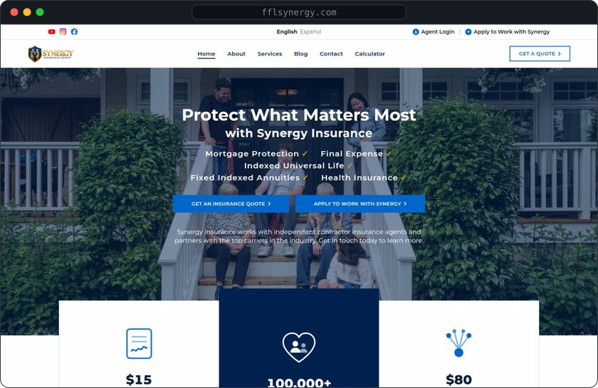
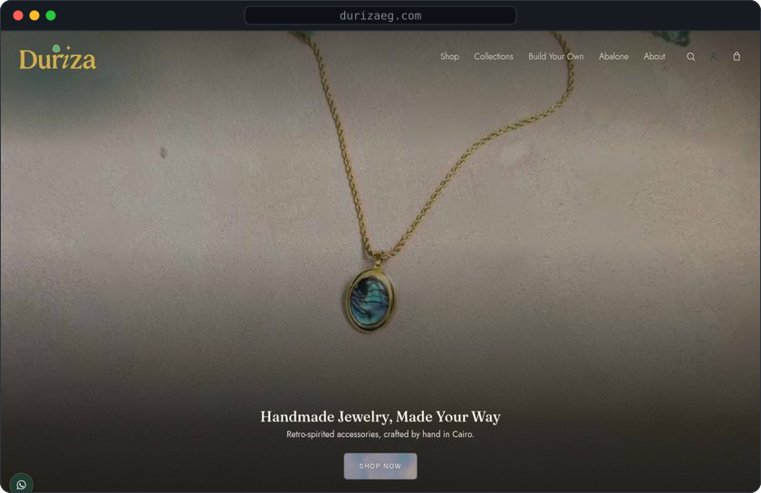
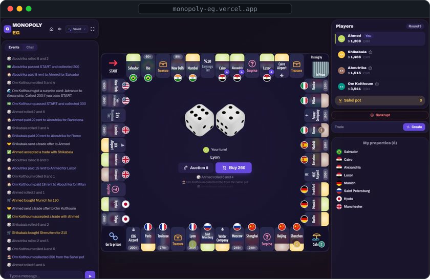
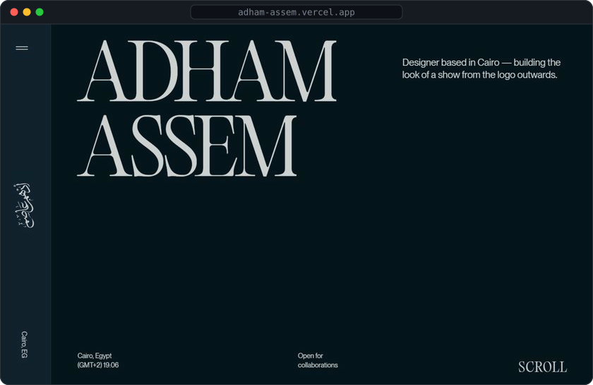
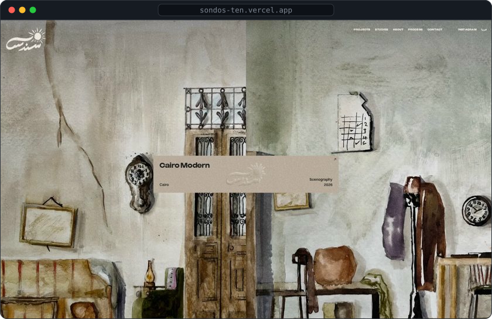
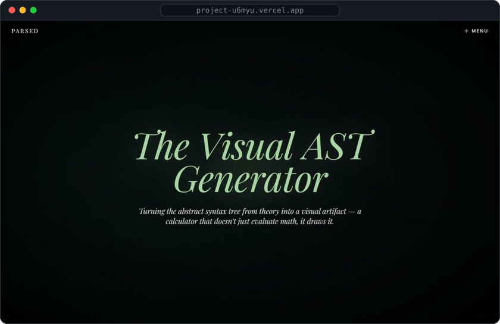

<!-- contribution graph from real data, cells pop in week by week.
     refreshed daily by .github/workflows/refresh-cards.yml -->

<h3><code>mohamed@github ~ $ ./contributions.sh</code></h3>

<picture>
  <source media="(prefers-color-scheme: light)" srcset="./contributions-light.svg">
  
</picture>

 
 

<!-- portrait.svg and stats.svg share an 840 x 880 canvas, so equal widths line them up.
     portrait: CROP=25,40,345 python scripts/portrait.py photo/me-cut.png   stats: python scripts/stats.py -->

<h3><code>mohamed@github ~ $ whoami</code></h3>

<table>
<tr>
<td valign="top"></td>
<td valign="top"></td>
</tr>
</table>

 
 

<h3><code>mohamed@github ~ $ cat about.md</code></h3>

<b>Every pixel is engineered.</b>

I'm Mohamed Samy, a software engineer and designer based in Egypt. 
I take products from the first sketch to production: research and flows, interface design, 
then the front-end and the backend behind it. Design and code live in the same head, 
so nothing gets lost between them.

<code>3 languages shipped</code>&nbsp; <code>2 countries served</code>&nbsp; <code>1 person, design → code → deploy</code>

UI/UX Design · Web Design · Front-end Engineering · Full-stack &amp; Backends · E-commerce · 3D &amp; Motion for the Web

 
 
 

<!-- cards: python scripts/cards.py (screenshots from the printed photos in my portfolio's 3D studio) -->

<h3><code>mohamed@github ~ $ ls ~/projects</code></h3>

<table>
<tr>
<td width="50%" valign="top">

<b>Synergy Insurance</b> 
A bilingual (English and Spanish) site for a US life-insurance agency: calculators, a blog, an agent portal and an admin CMS wired into their CRM. 
<code>Next.js</code> <code>Supabase</code> <code>next-intl</code> <code>GSAP</code>

</td>
<td width="50%" valign="top">

<b>Duriza</b> 
E-commerce for a Cairo studio making handmade jewelry: an editorial storefront, a made-to-order customizer, InstaPay and cash-on-delivery checkout. 
<code>React 19</code> <code>Supabase</code> <code>GSAP</code> <code>WebGL</code>

</td>
</tr>
<tr>
<td width="50%" valign="top">

<b>Monopoly EG</b> 
Monopoly with an Egyptian soul: 3D dice and pieces, bots named after Egyptian icons, online rooms, and contracts written in Arabic or English that AI turns into rules. 
<code>three.js</code> <code>Realtime</code> <code>Gemini</code> <code>Arabic / English</code>

</td>
<td width="50%" valign="top">

<b>Adham Assem</b> 
Portfolio for a scenographer and designer: WebGL page transitions that tear like paper and an Arabic calligraphy intro written stroke by stroke. 
<code>WebGL</code> <code>GSAP</code> <code>Art direction</code>

</td>
</tr>
<tr>
<td width="50%" valign="top">

<b>Sondos</b> 
A bilingual portfolio for an interior and set designer, with painterly WebGL effects, a sketchbook mode and plan hotspots. 
<code>GSAP</code> <code>WebGL</code> <code>Arabic / English</code>

</td>
<td width="50%" valign="top">

<b>Visual AST Generator</b> 
A long-form explainer for a compiler-theory project that turns source code into its abstract syntax tree and draws it as a visual artifact. 
<code>Compilers</code> <code>Editorial</code> <code>Visualization</code>

</td>
</tr>
</table>

also: <a href="https://eloquent-dirac-c2904ff.vercel.app">Algorithms at Home</a> · <a href="https://bold-moore-872d88.vercel.app">Circuits</a> · <a href="https://eloquent-dirac-c2904f.vercel.app">SJ Automotive Care</a> · <a href="https://adham-paper.vercel.app">Adham Assem — Broadcast</a>

 
 
 

<h3><code>mohamed@github ~ $ ./stack.sh</code></h3>

 
 
 

<h3><code>mohamed@github ~ $ ./links.sh</code></h3>

<b>Software Engineer · Web Designer · UI/UX Designer</b>

 

